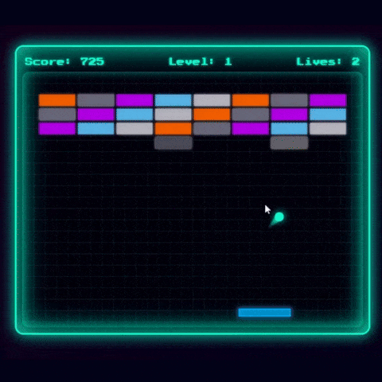

# 🎮 Brick Balls Game



A fun and interactive browser-based brick breaker game using HTML, CSS, JavaScript, and Tone.js for sound effects.

## 🚀 Features

- Paddle and ball mechanics
- Brick-breaking levels
- Power-ups and sound effects
- Score, lives, and level tracking
- Responsive UI with game-over and game-win messages

## 📁 Project Structure

Brick Balls Game/ │ ├── index.html # Main game HTML ├── script.js # JavaScript game logic ├── style.css # Game styling ├── create-neon-brick-breaker-game-using-html-css-js.gif # Demo GIF


## 🕹️ How to Play

1. Open `index.html` in your web browser.
2. Use the **left** and **right arrow keys** to move the paddle.
3. Break all the bricks to win the level.
4. Collect falling power-ups to boost gameplay.
5. Don't let the ball fall — you only have 3 lives!

## 🧑‍💻 Tech Stack

- HTML5 Canvas
- JavaScript (ES6+)
- CSS3
- [Tone.js](https://tonejs.github.io/) – for audio synthesis

## 🛠️ Setup Instructions

1. Download or clone this repository:
   ```bash
   ## 🛠️ Getting Started
   git clone https://github.com/lakshman200309/Brick_Balls_Game.git
   cd Brick_Balls_Game

# Open index.html in browser
2. Open the folder and run index.html in a web browser.
3. No server or build tools needed — it's all client-side!
